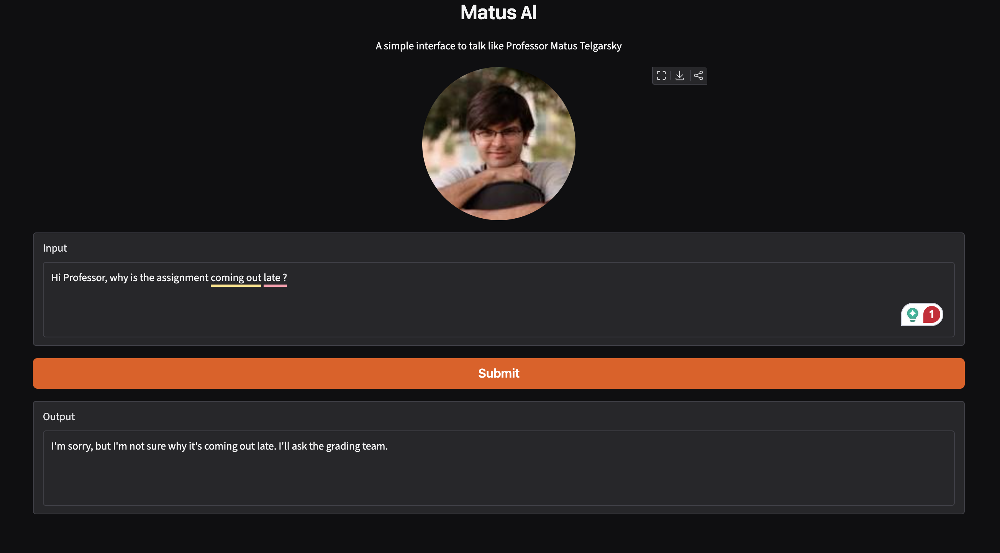
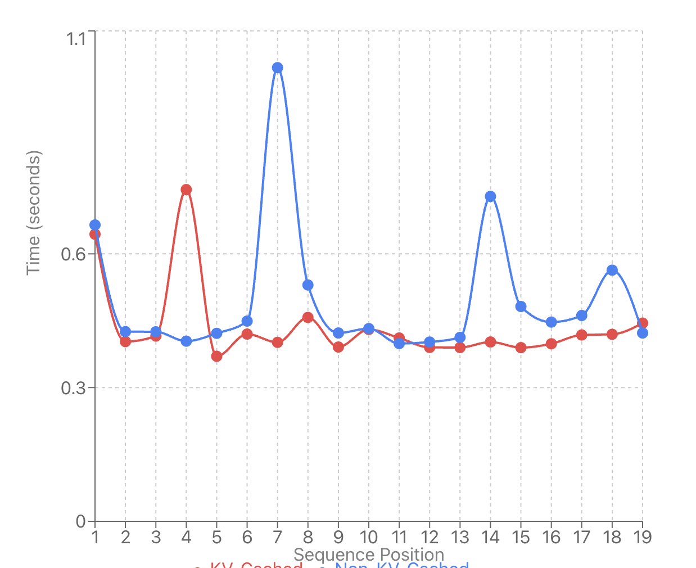
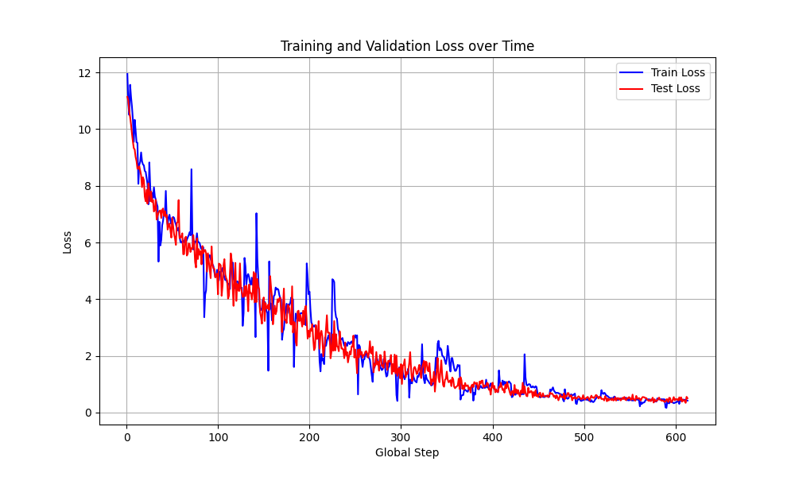

<div align="center">

# Small LLM Text Generator and Matus AI

### Training compact language models, fine-tuning TinyLlama, and studying how they generate text


</div>

This repository is an experimental language-modeling workspace with two connected goals:

1. Build and compare small causal language models from scratch, including Transformer, LSTM, K-gram MLP, and K-gram CNN architectures.
2. Fine-tune the 1.1B-parameter TinyLlama model for conversational style imitation and supervised reasoning tasks, then serve it through an interactive UI.

The featured application is **Matus AI**, a Gradio interface backed by a fine-tuned TinyLlama checkpoint. The repository also contains custom pretraining, post-training, generation, KV-cache, RoPE, and interpretability experiments.

## Matus AI Demo

<p align="center">
  
</p>

The interface accepts a message, adds contextual information about the target speaker, and streams a response from the fine-tuned model. The example above asks why an assignment is late and receives a response in the conversational style learned during supervised fine-tuning.

## What Is in This Repository

### TinyLlama supervised fine-tuning

`pretrained_model_sft_running.py` fine-tunes `TinyLlama/TinyLlama-1.1B-intermediate-step-1431k-3T` on structured question-answer examples.

The training pipeline:

- Formats examples as `User: ...` and `Assistant: ...`.
- Masks the user prompt so the training loss is calculated only over the assistant response.
- Uses configurable training and validation splits.
- Trains with AdamW and saves checkpoints when validation loss improves.
- Supports streaming generation with temperature scaling and top-p sampling.
- Runs on Apple MPS, CUDA, or CPU depending on hardware availability.

The project also includes a second supervised fine-tuning workflow for adding mathematical and logical reasoning behavior.

### Language models built from scratch

`pico_llm.py` implements several autoregressive models using PyTorch:

| Model | Purpose |
|---|---|
| Custom Transformer | Multi-head causal self-attention and next-token prediction |
| Transformer with RoPE | Tests rotary positional embeddings |
| KV-cache Transformer | Tests faster autoregressive generation |
| LSTM | Recurrent sequence-modeling baseline |
| K-gram MLP | Predicts tokens from a fixed local context window |
| K-gram CNN | Learns local token patterns with one-dimensional convolutions |

These models use GPT-2 tokenization and can be trained on TinyStories, repository text files, or a weighted mixture of both.

### Structured reasoning and post-training

`post_training.py` loads a pretrained custom Transformer checkpoint and performs answer-only supervised fine-tuning.

`create_graph_sft_dataset.py` generates natural-language graph descriptions and their structured adjacency encodings. For example:

```text
User: A is connected to B. B is connected to C.
Assistant: B - A, A C - B, B - C
```

The repository also contains utilities and datasets for Boolean question answering, TriviaQA, logical reasoning, and structured text generation.

### Interpretability

`interpretability.py` provides tools for inspecting how the trained models process prompts:

- Transformer attention-head visualizations
- LSTM hidden-state heatmaps
- High-variance neuron activation analysis
- K-gram activation visualizations

These experiments help compare how attention-based, recurrent, and fixed-context models represent information internally.

## System Workflows

### TinyLlama and Matus AI

```text
Conversational question-answer data
                |
                v
        TinyLlama 1.1B
                |
                v
   Supervised fine-tuning
                |
                v
  Optional reasoning fine-tuning
                |
                v
     Fine-tuned checkpoint
                |
                v
       Gradio interface
```

### Custom language models

```text
TinyStories and custom text
            |
            v
     GPT-2 tokenization
            |
            v
Transformer, LSTM, or K-gram model
            |
            v
Next-token cross-entropy training
            |
            v
Checkpointing and text generation
```

## Experimental Results

### KV-cache generation performance

The KV-cache experiment compares per-token generation time with and without cached attention keys and values.

<p align="center">
  
</p>

### Training and validation loss

The custom Transformer experiments log training and validation loss throughout pretraining.

<p align="center">
  
</p>

The figures in `figures/` and `diagrams/` correspond to exploratory runs with different Transformer, RoPE, graph-pretraining, and caching configurations.

## Technology Stack

| Area | Technologies |
|---|---|
| Language modeling | PyTorch, Hugging Face Transformers, TinyLlama |
| Tokenization | Tiktoken, SentencePiece, Hugging Face tokenizers |
| Data processing | Pandas, OpenPyXL, Hugging Face Datasets, PyArrow |
| Interface | Gradio |
| Evaluation and visualization | Matplotlib, scikit-learn, Livelossplot |
| Hardware | Apple MPS, NVIDIA CUDA, CPU fallback |

## Repository Structure

```text
small-llm-text-generator/
├── frontend.py                         # Gradio interface for Matus AI
├── pretrained_model_sft_running.py    # TinyLlama SFT and generation
├── pico_llm.py                        # Custom model architectures and pretraining
├── post_training.py                   # SFT for the custom Transformer
├── create_graph_sft_dataset.py        # Structured graph dataset generation
├── interpretability.py                # Attention and activation visualization
├── KgramCNN.py                        # K-gram CNN implementation
├── download_boolq.py                  # BoolQ dataset utility
├── download_triviaqa.py               # TriviaQA dataset utility
├── download_distilsft_simplereasoning.py
├── dataset/                            # Local training datasets
├── figures/                            # Training curves
├── diagrams/                           # Performance diagrams
├── checkpoints/                       # Custom model checkpoints
└── sft_checkpoints_minimal/           # TinyLlama checkpoints
```

## Installation

Python 3.11 is recommended.

```bash
git clone https://github.com/nilarnab/small-llm-text-generator.git
cd small-llm-text-generator

python3 -m venv .venv
source .venv/bin/activate
python -m pip install --upgrade pip
python -m pip install -r requirements.txt
```

## Model Checkpoint Setup

TinyLlama checkpoints are several gigabytes and are not stored in Git. Place a Hugging Face-compatible checkpoint directory under `sft_checkpoints_minimal/`.

The directory should contain files such as:

```text
config.json
generation_config.json
model.safetensors
tokenizer.json
tokenizer.model
tokenizer_config.json
```

Set `CHECKPOINT_PATH` in `pretrained_model_sft_running.py` to the checkpoint directory:

```python
CHECKPOINT_PATH = "./sft_checkpoints_minimal/your-checkpoint-directory"
```

Use a relative path so the project remains portable across computers.

## Run the Matus AI Interface

Activate the environment and launch the UI from the repository root:

```bash
source .venv/bin/activate
python frontend.py
```

Open the address printed by Gradio, normally:

```text
http://127.0.0.1:7860
```

The first launch can take several minutes because the application must load the full 1.1B-parameter checkpoint into memory.

## Train a Custom Transformer

The following example trains the enabled model in `pico_llm.py` using repository text data:

```bash
python pico_llm.py \
  --input_files 3seqs.txt \
  --tinystories_weight 0 \
  --device_id mps \
  --batch_size 4 \
  --num_epochs 3 \
  --prompt "Once upon a"
```

Use `cuda:0` instead of `mps` on a CUDA-capable machine, or `cpu` when no accelerator is available.

## Fine-Tune TinyLlama

Before training, configure these values in `pretrained_model_sft_running.py`:

```python
TRAIN_MODE = True
SFT_DATASET_PATH = "dataset/your_dataset.xlsx"
CHECKPOINT_PATH = None
```

The Excel dataset must contain `QUESTION` and `ANSWER` columns. Then run:

```bash
python pretrained_model_sft_running.py
```

To continue training from an existing checkpoint, set `CHECKPOINT_PATH` to that checkpoint directory instead of `None`.

## Run Post-Training

Generate the graph dataset:

```bash
python create_graph_sft_dataset.py
```

After setting the source checkpoint in `post_training.py`, run:

```bash
python post_training.py
```

## Generate Interpretability Visualizations

Transformer attention maps:

```bash
python interpretability.py \
  --mode attention \
  --model_type transformer \
  --checkpoint checkpoints/YOUR_CHECKPOINT.pt \
  --device cpu \
  --prompt "Question: Who won Super Bowl XX? Answer:"
```

K-gram activations:

```bash
python interpretability.py \
  --mode kgram \
  --model_type kgram \
  --checkpoint checkpoints/YOUR_CHECKPOINT.pt \
  --device cpu \
  --prompt "Question: In which year was CNN founded? Answer:"
```

Generated images are written to `interpretability_outputs/`.

## Current Limitations

- Model checkpoints are not included because they can exceed 4 GB.
- Some experimental scripts still require manually setting dataset or checkpoint paths.
- The custom architectures are research implementations and are not optimized for production training.
- Persona quality depends on the coverage and consistency of the supervised examples.
- The current evaluation focuses primarily on training loss and qualitative generations rather than a complete style-similarity benchmark.

## Future Work

- Add LoRA or QLoRA for memory-efficient fine-tuning.
- Quantize checkpoints for faster local inference.
- Add automated reasoning and style-similarity evaluations.
- Package checkpoint selection through command-line arguments.
- Expand interpretability experiments across fine-tuning stages.
- Improve the UI with conversation history and selectable model checkpoints.

## Disclaimer

This repository is an educational and research prototype. Persona-style models should be used transparently and with the knowledge and consent of the person whose communication style is represented.
